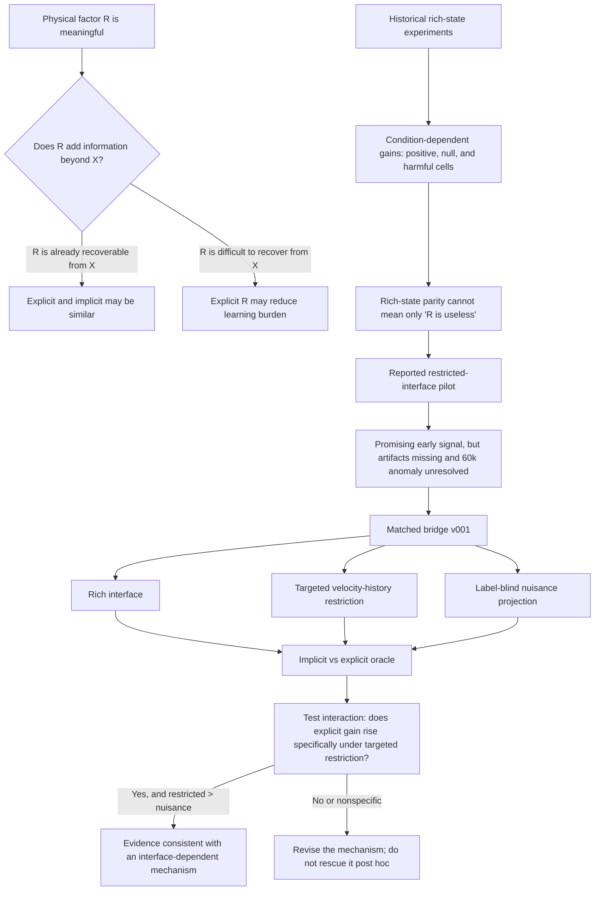
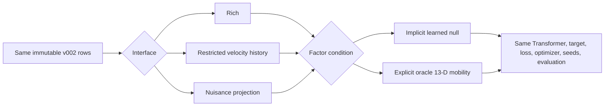

# When Is a Physical Factor Worth Making Explicit?

> **PHYWM experimental walkthrough**  
> A research narrative for advisor and collaborator discussions  
> **Evidence cut:** 2026-09-23  
> **Current formal status:** **SUBMITTED / SCIENTIFICALLY BLINDED**  
> **Formal bridge:** 18 registered runs, Slurm array `77046` (`0-5%2`)  
> **No formal bridge outcome is reported in this document.**

---

## How to read this page

This page tells the scientific story in chronological order, but it also marks the strength of every claim.

| Badge | Meaning |
|---|---|
| **FROZEN / REGISTERED** | Fixed before the relevant scientific outcomes were inspected |
| **COMPLETED OBSERVATION** | Directly measured and recoverable from stored artifacts |
| **DOCUMENTARY OBSERVATION** | Preserved in a frozen historical report, but raw artifacts are unavailable for independent recomputation |
| **PRELIMINARY** | Hypothesis-generating evidence; not a formal result |
| **RUNNING / BLINDED** | Execution exists, but scientific outcomes must not be inspected yet |
| **PLANNED** | A future mechanism test, not present evidence |

> [!IMPORTANT]
> The project is not asking whether “physics” is universally better than learning. It asks a narrower and more useful question: **when does one particular physical factor add predictive information beyond what the learner can already recover from its observation interface?**

### The research question in one sentence

> **Under a fixed data and model budget, when does exposing a specific physical factor explicitly improve compact action-conditioned dynamics learning?**

The current physical factor is articulated-object mobility: the kinematic constraint that determines whether and how a moving part can translate or rotate.

---

# Meeting-first: the one-page research logic



### The central inferential move

The implicit and explicit predictors are

\[
\text{Implicit:}\quad F_\theta(X_t,U_t)\rightarrow Y,
\]

\[
\text{Explicit:}\quad F_\theta(X_t,R_t,U_t)\rightarrow Y.
\]

If the physical factor is already recoverable from the observation,

\[
R_t \approx f(X_t),
\]

then it is possible that

\[
p(Y\mid X,U,R)\approx p(Y\mid X,U).
\]

Therefore, **explicit ≈ implicit does not imply that mobility is physically irrelevant**. It can mean that the representation has already placed mobility on the learnable side of the interface boundary.

### Evidence ladder

| Stage | What it contributed | Evidence status |
|---|---|---|
| Historical Stage C | Showed that explicit mobility can be positive, neutral, or harmful depending on history, data, encoding, and architecture | **DOCUMENTARY OBSERVATION**; summary recovered, raw 150-run artifacts not recovered |
| Alternate-backbone Phase I | Tested rich-interface implicit/explicit conditioning in GNS and GRU | **PARTIAL COMPLETED OBSERVATION**; 6/12 runs complete in accessible artifacts |
| Restricted / robot-observable pilot | Suggested a larger explicit benefit after reducing direct mobility evidence | **PRELIMINARY / NOT INDEPENDENTLY REPRODUCIBLE** |
| Matched bridge v001 | Manipulates information interface while matching data, learner, target, budget, and evaluation | **FROZEN; SUBMITTED; SCIENTIFICALLY BLINDED** |

---

# A. Research question

## What we originally wanted to know

Compact world models must predict how a controlled object will move under an action. For articulated objects, a door and a drawer can receive similar forces but obey different constraints. A model may learn those constraints implicitly from trajectories, or receive an explicit kinematic description.

The comparison is:

```text
                        observation / state X
                                  |
                 +----------------+----------------+
                 |                                 |
          implicit learner                  explicit learner
              [X, U]                         [X, R, U]
                 |                                 |
                 +----------------+----------------+
                                  |
                         future dynamics Y
```

An explicit factor might reduce the amount of structure the dynamics network must rediscover. But a valid experiment cannot give the explicit model more parameters, easier examples, a different target, or a friendlier checkpoint rule and then attribute the result to the factor.

## Why this is a representation-boundary question

The project does **not** propose a universal physics ontology. It studies one deliberately bounded intervention: moving a known mobility factor from latent/recoverable information inside `X` to a directly supplied input `R`.

The scientific object is the factor's **marginal information value**:

\[
I(Y;R\mid X,U).
\]

Intuitively, this asks: after the model already knows the observation history and action, how much uncertainty about the future is removed by also knowing mobility? A factor can be physically essential while adding little conditional information if `X` already reveals it.

## What must stay fixed

For an implicit/explicit comparison to support a representation claim, the following must be matched:

- dataset rows, splits, counterfactual branches, and sample order;
- model family, dimensions, parameter count, initialization scheme, and prediction head;
- prediction target and loss;
- optimizer, learning rate, batch size, precision, and training budget;
- checkpoint selection and evaluation metrics;
- seed pairing;
- all inputs except the registered interface transform and the factor value.

The current bridge was designed around exactly these constraints.

---

# B. Original hypothesis

The original intuition was straightforward: explicit mobility might

- reduce the burden of inferring the allowed motion subspace;
- encode articulated structure directly;
- improve sample efficiency under a limited data budget;
- improve out-of-distribution prediction across assets;
- help compact models that cannot cheaply rediscover the same structure.

But **physical relevance is not sufficient for predictive utility**. Supplying `R` changes the learning problem. The network must learn how `R` aligns with `X`, which components matter, how to fuse it, and when it is redundant. A redundant or badly integrated factor can be neutral or harmful.

This yields the project's “when” framing:

> Explicit physical information is useful only when its reduction in inference burden exceeds the cost of representing, fusing, and optimizing around the added channel.

---

# C. Evidence lineage before the bridge

The phrase “Phase I” has been used in more than one handoff. To prevent accidental conflation, this walkthrough separates the evidence into four named stages.

## C1. Historical shared-Transformer Stage C

### Why did we run it?

To map where explicit mobility helped across history length, data budget, capacity, factor encoding, and architecture.

### What changed?

The historical matrix varied history, training-data fraction, capacity, factor representation, and a residual-MLP comparison. The primary development metric was six-step autoregressive articulated-state error `L6`, with positive relative gain favoring explicit conditioning.

### What stayed fixed?

Within each registered cell, implicit and explicit models were paired across five seeds and evaluated on val-ID and dev-OOD.

### What can it support?

The recovered report supports a **conditional**, not universal, account of explicit utility. It cannot support independent recomputation because the raw Stage C registry, generated configs, per-run summaries, and metric CSVs were not recovered.

> [!WARNING]
> **DOCUMENTARY OBSERVATION.** The numbers below are preserved verbatim in the historical `docs/results.md` extracted from pristine import commit `d190cbe4...`. The Stage C recovery audit found no raw result artifacts in the accessible Gulf environment.

| Historical cell | val-ID explicit gain | dev-OOD explicit gain | Evidence-limited reading |
|---|---:|---:|---|
| H=8, full data, 25.54M | +4.86% | +7.28% | Same-direction positive historical cell |
| H=16, full data, 25.54M | +6.86% | −3.34% | ID benefit did not transfer to OOD |
| H=4 full reference | −0.17% | −7.41% | Null / negative-leaning |
| 25% data | +9.89% | +8.82% | Positive low-data cell |
| 50% data | not quoted in recovered summary | +9.71% | OOD-only quoted result |
| 10% data | not quoted in recovered summary | −6.93% | OOD harm |
| symbolic H=4 | −3.72% | −5.68% | Symbolic type alone insufficient |
| computed H=4 | −5.10% | +0.91% | No robust common-direction benefit |
| residual MLP H=4 | −4.97% | −12.95% | Explicit conditioning harmful in this cell |

**Observation.** The reported effect changed sign across history, data, encoding, split, and architecture.

**Interpretation.** This rejects a simple “explicit physics always helps” story. It instead suggests that explicit-factor value is conditional on what the representation already reveals and how the learner uses it.

**Alternative explanations.** Capacity, optimization, checkpoint mismatch, dataset fraction, or architecture-specific fusion could produce the same pattern.

**Next test.** Manipulate the information interface directly while holding the rest of the learning problem fixed—the matched bridge.

Traceability: `/sciclone/data10/mliu22/PHYWM-stage-c-recovery-20260922/reports/recovery_report.md` and `recovered/docs/docs__results.md`.

## C2. Standalone-v002 alternate-backbone Phase I

This is the **registered Phase I design** referred to by the current local repository.

### Why did we run it?

To ask whether explicit-mobility utility changes under two compact, non-Transformer temporal inductive biases: a graph-network encode-process-decode model and a stacked GRU baseline.

### Frozen design

| Backbone | Interface | Condition | Seeds | History | Data |
|---|---|---|---|---:|---|
| GNS EPD | rich | implicit | 0, 1, 2 | 8 | full v002 |
| GNS EPD | rich | explicit continuous | 0, 1, 2 | 8 | full v002 |
| GRU temporal | rich | implicit | 0, 1, 2 | 8 | full v002 |
| GRU temporal | rich | explicit continuous | 0, 1, 2 | 8 | full v002 |

The GNS uses ten nodes per timestep—moving link, virtual end effector, and eight geometry points—with residual message passing and a GRU over graph summaries. The GRU encodes each timestep conventionally, exposes the current action at the final token, and uses the same target interface.

| Frozen field | Phase I value |
|---|---|
| Optimizer | AdamW |
| Learning rate / weight decay | `3e-4` / `0.01` |
| Gradient clipping | `1.0` |
| Precision / train batch / eval batch | bf16 / 128 / 128 |
| Evaluation interval | 5,000 optimizer steps |
| Multi-step loss weight | `0.1` |
| Convergence | minimum 100k; 30k patience; 1% relative improvement; maximum 200k |
| Selection | minimum val-ID normalized one-step MSE |
| Reported splits | val-ID and dev-OOD only |
| Primary comparison | paired-seed relative gain in six-step rollout `L6` |

Parameter counts are matched **within** backbone and condition path, not across the two backbones:

- GNS: 11,099,437 total/trainable parameters;
- GRU: 11,546,925 total/trainable parameters.

The implicit path retains the factor encoder and learned null factor; explicit conditioning does not gain an extra module that implicit lacks.

Traceability: `configs/backbone_factor_screen_v001/spec.json`, `runs/backbone_factor_screen_registry.csv`, `handoff/alternate_backbones_v001/SCIENTIFIC_PROTOCOL.md`, and `src/phywm/models/dynamics.py`.

### Current evidence from Phase I

> [!CAUTION]
> **PARTIAL COMPLETED OBSERVATION — 6 of 12 registered runs.** The checked-in aggregate still reports `incomplete_inventory_only`; the remaining six runs needed for a complete three-seed result are absent from the accessible artifact inventory. No final backbone gate can be assigned.

Six identity-valid runs from lanes 2 and 3 are complete: GNS seed 1 and GRU seeds 0 and 2, each with implicit and explicit counterparts.

| Backbone / seed | val-ID implicit L6 | val-ID explicit L6 | val-ID gain | dev-OOD implicit L6 | dev-OOD explicit L6 | dev-OOD gain |
|---|---:|---:|---:|---:|---:|---:|
| GNS / 1 | 0.02617970 | 0.02615905 | +0.0789% | 0.00793015 | 0.00912021 | −15.0068% |
| GRU / 0 | 0.03426101 | 0.03428583 | −0.0724% | 0.00794661 | 0.00793966 | +0.0875% |
| GRU / 2 | 0.03428587 | 0.03430519 | −0.0564% | 0.00793900 | 0.00796234 | −0.2940% |

For the two completed GRU pairs, the provisional arithmetic mean gain is −0.0644% on val-ID and −0.1033% on dev-OOD.

**Observation.** The completed GRU pairs are close to parity. The one completed GNS pair is also near parity on val-ID but shows materially worse dev-OOD `L6` with explicit conditioning.

**Interpretation.** These completed pairs are compatible with low marginal factor value under the rich interface.

**Alternative explanations.** Missing seeds, architecture-specific optimization, checkpoint selection by one-step rather than `L6`, and seed variance remain unresolved.

**Next test.** Do not select a bridge backbone based on this unfinished screen. Instead use a preregistered shared Transformer and manipulate interface information directly.

Traceability: `docs/partial_results_lanes_2_3.md`. The local `runs/backbone_factor_screen_summary.json` remains a deliberately withheld/incomplete aggregate and should not be mistaken for a zero-effect result.

---

# D. What the pre-bridge evidence changed

The early question sounded like:

> Does explicit mobility beat implicit learning?

The evidence made that question inadequate. A rich state contains moving-link and virtual-end-effector poses and velocities across eight intentionally excited frames. From these, a learner can infer much of the allowed motion:

- angular velocity reveals revolute behavior and its axis;
- linear velocity reveals prismatic direction and revolute tangential motion;
- position plus linear/angular velocity supports pivot recovery;
- the virtual end effector repeats or amplifies the lever-arm relation;
- pose changes provide another trajectory cue even if velocities are removed.

The repository even contains a computed-factor routine based on these sufficient-statistic ideas. In the v002 manifest, 99.846875% of histories are marked informative and 84.877% of history transitions are nonzero.

Thus rich implicit versus rich explicit alone cannot distinguish among:

1. mobility has little predictive value;
2. mobility matters but is already recoverable from `X`;
3. the learner receives `R` but does not use it;
4. capacity or optimization hides its value;
5. an explicit redundant channel increases learning burden.

The refined hypothesis became:

> **The marginal value of explicit mobility depends on how recoverable mobility already is from the model's input interface.**

---

# E. Restricted / robot-observable pilot

### Why was it interesting?

A handoff described a pilot that reduced direct mobility evidence and compared implicit, explicit-estimated, and explicit-oracle conditions. The reported 20k moving-part errors were 6.72 mm, 6.36 mm, and 6.37 mm, respectively. Relative to implicit, the 6.36 mm estimated-factor value corresponds to approximately **+5.36%** lower error.

At 60k, the reported moving-part values were 5.21 mm implicit, 4.96 mm explicit-estimated, and an anomalous 10.06 mm explicit-oracle.

> [!WARNING]
> **PRELIMINARY / HYPOTHESIS-GENERATING ONLY.** A dedicated audit found no Phase II/v003 source tree, configs, estimator, registry, checkpoints, logs, evaluator, seed-level summaries, or raw per-episode outputs in the accessible local or Gulf environment. The numbers above exist only as handoff claims and are **not independently reproducible**.

### What can—and cannot—be concluded

**Fact.** The handoff-reported 20k values imply an approximately 5.36% estimated-factor improvement in the moving-part view and roughly similar early oracle performance.

**Interpretation.** If the compared conditions were genuinely matched, this would be consistent with explicit utility increasing when direct mobility evidence is reduced.

**Alternative explanation.** The apparent gain could arise from unmatched inputs, estimator supervision, parameter budget, selection, evaluation, seeds, or data. The 60k oracle anomaly could be one bad seed, a wrong checkpoint, a schema/frame error, an evaluation bug, or genuine instability.

**Next test.** Build a new bridge from the immutable standalone-v002 dataset with an exact, audited interface manipulation, matched parameter count, nuisance control, and identity-bound evaluation.

The correct takeaway is therefore not “the pilot proved the hypothesis.” It is:

> **The pilot supplied a plausible mechanism worth testing under a fully matched design.**

Traceability: `/sciclone/data10/mliu22/PHYWM-phase2-audit-20260922/reports/phase2_integrity_audit.md`, `oracle_anomaly_forensics.md`, and `tables/pilot_result_provenance.csv`.

---

# F. The matched-bridge experiment

## The centerpiece

The bridge treats **information interface** as the main manipulated variable.



### Why did we run it?

To test whether explicit-factor utility changes when mobility-relevant evidence is selectively reduced.

### What exactly changes?

Only two registered fields:

1. the deterministic input interface (`rich`, `restricted_velocity_history`, or `nuisance_projection`);
2. the factor value (learned null for implicit, oracle 13-D factor for explicit continuous).

### What stays fixed?

- the immutable `mobility-partnet-hf-mvp-v002` samples and splits;
- the same state histories and same-state counterfactual branches;
- current action, geometry, target, and sample order;
- small shared Transformer: width 384, depth 6, 8 heads, dropout 0;
- exactly 10,993,197 trainable parameters in all six cells;
- factor encoder and factor-token position in both conditions;
- H=8, bf16, batch 128, AdamW, learning rate `3e-4`;
- 100,000 optimizer steps for every run;
- paired seeds 0, 1, and 2;
- checkpoint selection and val-ID/dev-OOD evaluation.

### What conclusion can it support?

It can estimate an **interface × factor-condition interaction** under this dataset, Transformer, and frozen interface. It cannot prove that mobility is universally recoverable, that every architecture behaves the same way, or that oracle factors are deployable.

> [!NOTE]
> This is not backbone shopping, not resampling for a favorable result, and not a target change. The shared Transformer was selected prospectively for its clean temporal-token boundary and exact matched conditioning path, while the GNS/GRU screen was unfinished.

---

# G. What the learner sees

## Shared tensors

| Tensor | Per-sample shape | Meaning |
|---|---:|---|
| `state_history` | `[8,31]` | Eight real simulator observations in SAPIEN world coordinates |
| `action` | `[7]` | Current normalized `[linear3, angular3, gripper1]` wrench/delta proxy |
| `geometry` | `[8,3]` | Moving-link local-frame AABB corners |
| `factor` | `[13]` | Oracle mobility in articulation-root local frame, or learned null |
| target | `[32]` | Normalized 31-D next-state delta plus scalar active-joint-coordinate delta |
| rollout target | six steps | Autoregressive evaluation only |

The 31 state channels are:

| Indices | Field |
|---:|---|
| `0:3` | moving-link position |
| `3:9` | moving-link continuous rotation 6D |
| `9:12` | moving-link linear velocity |
| `12:15` | moving-link angular velocity |
| `15:18` | virtual-EE position |
| `18:24` | virtual-EE continuous rotation 6D |
| `24:27` | virtual-EE linear velocity |
| `27:30` | virtual-EE angular velocity |
| `30` | gripper state (stored zero in this dataset) |

The 13-D factor is `[axis3, pivot-or-zero3, pivot-valid1, twist-v3, twist-omega3]`. Revolute factors use `omega = axis` and `v = -axis × pivot`; prismatic factors use `v = axis`, `omega = 0`, and zero pivot padding.

Metadata such as asset ID, joint label, joint limits, paths, split, episode, and branch IDs is excluded from model inputs.

Traceability: `docs/data_schema.md`, `src/phywm/factors/mobility.py`, `src/phywm/data/partnet.py`, and the bridge package's `protocol/interface_definitions.md`.

---

# H. The three interfaces

## H1. `rich`

**Definition.** The final eight v002 history frames are passed through the original train-statistic normalization with no additional missingness mask. The current action is inserted only at the final timestep. Stored prehistory excitation actions are not model inputs.

**Why mobility may be recoverable.** The learner sees seven prior frames plus the current frame, including full link and virtual-EE poses and velocities. The history was generated to be informative, so allowed motion type, axis, and sometimes pivot can be inferred from the trajectory.

**Scientific role.** Rich is the baseline. It measures explicit utility when the existing observation already contains strong mobility cues.

## H2. `restricted_velocity_history`

**Definition.** Starting from the same raw rich history:

- only prior timesteps `τ = -7,…,-1` are affected;
- link linear/angular velocity channels `9:15` are replaced;
- virtual-EE linear/angular velocity channels `24:30` are replaced;
- replacement uses the frozen train-only raw state means;
- the ordinary z-score then maps these entries to exact normalized zero;
- the current frame `τ = 0` is entirely unchanged;
- no mask bit, learned embedding, or parameter is added.

```text
time:      -7   -6   -5   -4   -3   -2   -1    0
pose:       ✓    ✓    ✓    ✓    ✓    ✓    ✓    ✓
velocity:   ×    ×    ×    ×    ×    ×    ×    ✓
action:                                             current only
```

**Why target these features?** Prior angular velocity makes revolute type and axis easier to infer. Prior linear velocity reveals prismatic direction and tangential motion. Link and virtual-EE velocity together expose the lever-arm relationship needed for pivot recovery.

**What remains.** This is not a mobility-free observation. All prior poses, current pose and velocity, geometry, virtual-EE pose, current action, and sample identity remain. Pose differences can still reveal the motion subspace.

**Why this is not intended to cripple the model.** The complete current Markov state is preserved. The intervention selectively removes a high-value temporal cue, rather than deleting current physical state or changing the target.

**Collateral loss.** The manipulation also removes acceleration/damping history, velocity denoising, inertia/contact-response clues, and pose–velocity consistency. This is why the nuisance control is necessary.

## H3. `nuisance_projection`

**Definition.** For each prior frame, the transform takes 19 normalized non-velocity coordinates—indices `0..8`, `15..23`, and `30`—and removes a fixed rank-12 projection:

\[
z' = z - \alpha Q(Q^\top z).
\]

The projection is:

- label-blind and outcome-blind;
- built once with NumPy PCG64 seed 1729;
- based on a `19 × 12` standard-normal matrix followed by reduced QR;
- column-sign canonicalized;
- applied only at prior frames `τ=-7,…,-1`;
- energy-matched to the restricted velocity removal with `α = 0.8540386232640063`;
- frozen at SHA-256 `6a4207e9b04afcb7503c16628d75657f6b40c5b64a865296b981d7af17b978e5`.

The restricted operation removes mean normalized energy 8.7107777859 per prior frame; the unscaled nuisance projection removes 11.9426831809. The fixed `α` matches the training-population energy.

**Scientific purpose.** The nuisance interface asks whether any comparable degradation of the representation makes the explicit channel look better.

- If restricted and nuisance produce similar gains, the effect may be generic information degradation.
- If the explicit gain rises substantially more under targeted restriction, that is more consistent with the proposed mobility-access mechanism.

**Limitation.** Dense non-velocity directions can still contain mobility information. Equal rank and energy do not imply equal mutual information. The nuisance control improves specificity; it does not make the design perfect.

---

# I. Formal experimental matrix

## Frozen 18-run matrix

| Lane | Interface | Condition | Seeds | Registered run prefix |
|---:|---|---|---|---|
| 0 | `rich` | `implicit` | 0, 1, 2 | `br1-rich-imp-h8-*` |
| 1 | `rich` | `explicit_continuous` | 0, 1, 2 | `br1-rich-exp-h8-*` |
| 2 | `restricted_velocity_history` | `implicit` | 0, 1, 2 | `br1-rvh-imp-h8-*` |
| 3 | `restricted_velocity_history` | `explicit_continuous` | 0, 1, 2 | `br1-rvh-exp-h8-*` |
| 4 | `nuisance_projection` | `implicit` | 0, 1, 2 | `br1-nproj-imp-h8-*` |
| 5 | `nuisance_projection` | `explicit_continuous` | 0, 1, 2 | `br1-nproj-exp-h8-*` |

Each lane runs its three seeds serially. At most two lanes run concurrently.

## Frozen common scientific fields

| Field | Value |
|---|---|
| Model | small `shared_transformer` |
| Dimensions | width 384, depth 6, 8 heads, dropout 0 |
| Parameters | exactly 10,993,197 trainable in every cell |
| History | 8 |
| Precision | bf16 |
| Train / eval batch | 128 / 128 |
| Optimizer | AdamW |
| Learning rate / weight decay | `3e-4` / `0.01` |
| Gradient clipping | `1.0` |
| Multi-step loss weight | `0.1` |
| Evaluation interval | 5,000 steps |
| Training budget | exactly 100,000 optimizer steps |
| Checkpoint selection | minimum val-ID normalized one-step MSE |
| Primary outcome | val-ID six-step `L6` at selected checkpoint |
| Secondary outcomes | dev-OOD `L6`, one-step MSE, full curves, per-asset distributions |
| Prohibited splits | test-ID and locked-test-OOD |

The bridge's 100k maximum is a prospective formal freeze. It differs from Phase I's inherited 200k ceiling. Because formal bridge minimum and maximum are both 100k, every bridge run reaches exactly 100,000 steps; the retained patience fields are provenance only.

## Scheduler identity

| Item | Frozen / submitted value |
|---|---|
| Slurm array | `77046` |
| Submission timestamp | 2026-09-23 11:34:02 America/New_York |
| Array | `0-5%2` |
| Scheduler | `/sciclone/data10/mliu22/PHYWM-bridge-formal-v001/schedulers/wm_bridge_formal_v001.sbatch` |
| Partition | `batch` |
| GPU | 1 × NVIDIA A40 per lane |
| CPU / RAM | 8 CPUs / 32 GiB per lane |
| Wall time | 24 hours per lane |
| Execution commit | `c2851ec8087900d540a474ffda1c79c2147c7992` |
| Scientific hash | `05cc4f85ab82757790ccfd2791849a4cf2f8029fc0947629d462fafda242631e` |

At the post-submission execution-identity check, all six array members were registered and pending for scheduler priority, with concurrency cap two and no duplicate formal submission. This is an execution-health statement, not a scientific result. Runtime state may change after this evidence cut.

> [!CAUTION]
> Scientific blinding remains in force until all 18 identity-valid runs are complete. Intermediate bridge losses, gains, rankings, and cell comparisons are intentionally absent.

Traceability: bridge package `registry/assignments.json`, `registry/bridge_formal_registry.csv`, `provenance/scientific_identity_manifest.json`, `schedulers/wm_bridge_formal_v001.sbatch`, and `aggregator/aggregate_bridge_formal.py`.

---

# J. Dataset provenance

## Immutable standalone-v002 identity

| Item | Verified value |
|---|---|
| Dataset | `mobility-partnet-hf-mvp-v002` |
| Upstream repository | `sapien-sim/PartNetMobility` |
| Frozen upstream revision | `ee0aa3ef1df16181d76d83f7415aa8c94ed1da8f` |
| Downloaded / structurally valid archives | 346 / 346 |
| Invalid archives | 0 |
| Door-eligible archives | 259 |
| Drawer-eligible archives | 132 |
| Unique eligible assets | 325 |
| Door/drawer overlap | 66 assets |
| Frozen asset split | 227 train / 49 dev / 49 locked |
| Shards | 16 |
| Branch groups | 64,000 |
| Samples / transitions | 512,000 |
| Branches per group | exactly 8 |
| Split counts | 286,720 train; 35,840 val-ID; 35,840 test-ID; 76,800 dev-OOD; 76,800 locked-test-OOD |
| Schedule SHA-256 | `8bad4b5f88c5fabb3b37676b67b6ebb676ffc0c3d55011445601553eb63c884b` |
| W&M reproduction manifest SHA-256 | `ca0dc9c3e7d2e426a62d205174beaeab135a13c382455cd3f7183ef1b0e81343` |

Post-merge validation reported zero asset leakage, empty group/history overlap across exposed splits, zero failures, and maximum state-clone and no-action-replay errors of 0.0.

### The `9f841a34…` discrepancy

An older note called `9f841a34023649288caa57ef705c4ec98689022e115fd7d9b080f51d57ca51bf` the dataset fingerprint. That value belongs to an obsolete **v001 prepared-dataset pointer assumption**. Standalone-v002 contains no such pointer and does not require its independently regenerated manifest to match that hash.

The bridge's authoritative dataset identity is the validated local reproduction manifest:

`ca0dc9c3e7d2e426a62d205174beaeab135a13c382455cd3f7183ef1b0e81343`.

This distinction matters: provenance should prevent silent data changes, not reject a correct independent reproduction because it was compared with an unrelated old pointer.

### Why provenance matters scientifically

The bridge must not obtain an effect from new sampling, different assets, altered split membership, or regenerated counterfactual branches. Every bridge config binds the same manifest SHA. The interface transform happens at model input time; it does not rewrite a shard.

Traceability: `data/manifests/mobility-partnet-hf-mvp-v002-schedule.json`, `data/manifests/partnet-storage-furniture-hf-ee0aa3ef-v001.json`, `docs/environment_audit.md`, `docs/prelaunch_report.md`, and the final dataset `manifest.json`.

---

# K. Same-state counterfactual branching

Ordinary observational trajectories can confound action with state: action A may occur mostly in easy states and action B in hard states. V002 instead evaluates multiple actions from an exactly cloned simulator state.

```text
                         same cloned X_t
                               |
        +----------+-----------+-----------+----------+
        |          |           |           |          |
       U1         U2          U3          ...         U8
        |          |           |                       |
       Y1         Y2          Y3          ...         Y8
```

Each of 64,000 branch groups contains exactly eight branches. The generator restores the same state before each action, verifies clone/replay consistency, and stores a six-step rollout target for every branch.

### Why did we use it?

To expose action-conditioned differences without relying only on unrelated states from different trajectories.

### What changes within a branch group?

The current action and resulting future.

### What stays fixed?

The pre-action state, history, asset, joint, and split membership.

### What can it support?

It strengthens attribution of prediction differences to action-conditioned dynamics and supports counterfactual ranking metrics. It does not turn the study into a randomized trial over every modeling decision; interface and optimization confounds still require matched cells.

---

# L. Loss, evaluation, and formal estimands

## What `L6` measures

At every rollout horizon, the evaluator combines:

1. link-position error divided by the frozen train-derived `s_p95_m` scale;
2. rotation geodesic error divided by `π`;
3. absolute active-joint-coordinate error divided by joint range.

The three terms are averaged per horizon, and the six horizons are averaged to form `L6`. Lower is better. The model is autoregressive: after the first prediction, its predicted state—not future ground truth—is fed back.

Traceability: `src/phywm/train/runner.py` (`evaluate_model`, including the `primary` calculation and `L6` aggregation).

## Registered effects

Let `L[I,C,s]` be val-ID `L6` for interface `I`, condition `C`, and seed `s`, evaluated at that run's checkpoint selected by minimum val-ID normalized one-step MSE.

For each interface and seed:

\[
g[I,s]=\frac{L[I,\mathrm{implicit},s]-L[I,\mathrm{explicit},s]}
{L[I,\mathrm{implicit},s]}.
\]

Positive `g` means the explicit oracle model has lower `L6`.

The primary interaction is:

\[
\Delta_{\mathrm{interface}}[s]
=g[\mathrm{restricted},s]-g[\mathrm{rich},s].
\]

The directional working hypothesis is:

\[
\operatorname{mean}_s\Delta_{\mathrm{interface}}[s] > 0.
\]

The secondary specificity contrast is:

\[
\Delta_{\mathrm{specific}}[s]
=g[\mathrm{restricted},s]-g[\mathrm{nuisance},s].
\]

### Why the interaction is the real test

The project should not be judged by whether one explicit model happens to have lower loss. The mechanism predicts a change in explicit utility as recoverability changes. A positive `g_restricted` is therefore less informative than a positive, consistent `g_restricted − g_rich`, especially if `g_restricted` also exceeds the nuisance control.

### Registered summaries

For every gain and contrast, the final analysis reports:

- all three paired seed values;
- arithmetic mean and sample standard deviation;
- two-sided 95% Student-t interval with 2 degrees of freedom;
- component `L6` values and absolute differences;
- selected checkpoint steps and full learning curves;
- secondary dev-OOD versions;
- per-asset distributions;
- a separate paired asset bootstrap with seed 20260923 and 10,000 draws.

With only three seeds, the seed interval will be wide and unstable. It is descriptive uncertainty, not a binary proof of significance. No universal 5% threshold is registered for the bridge.

> [!NOTE]
> Checkpoint selection uses one-step normalized MSE while the primary scientific outcome is six-step `L6`. That inherited mismatch may reduce power, but it is common across all cells and avoids outcome-aware checkpoint reselection.

---

# M. How we will interpret the results

The table below is an explanatory expansion of the frozen interpretation rules. “Approximately equal” means small relative to reported seed and object uncertainty; bridge v001 does not register a numerical equivalence margin.

| Observed pattern | Interpretation supported | What it would not prove |
|---|---|---|
| `rich ≈ 0`, `restricted > 0`, `nuisance ≈ rich` | Strongest evidence consistent with interface-dependent explicit utility specific to mobility-relevant restriction | Mobility is unrecoverable; universality across architectures |
| `rich ≈ 0`, `restricted ≈ 0` | No evidence that this frozen restriction increases explicit utility | Mobility is physically irrelevant in every task |
| `restricted > 0` and `nuisance > 0` similarly | Gain may follow generic representation degradation | Mobility-specific mechanism |
| `rich > 0` and `restricted > rich` | Explicit factor helps in rich state and more under restriction | That every explicit representation will help |
| `rich > 0` and `restricted ≈ rich` | General inductive-bias or sample-efficiency effect is more plausible than a strong interface interaction | Recoverability mechanism |
| `restricted < rich` | Restriction does not increase explicit utility and may make conditioning harmful | License to search post hoc for a friendlier mask |
| explicit degrades performance | Added channel may create redundancy, fusion burden, or harmful shortcuts | That the underlying physical factor is false |

### Anti-rescue rule

A null or negative interaction is a valid scientific outcome. After bridge outcomes are examined, the project must not search for a new mask, backbone, split, checkpoint rule, extra seeds, or budget merely to reverse the conclusion.

---

# N. Why explicit information can hurt

Moving from `[X,U]` to `[X,R,U]` is not free. The network must learn:

- how `R` relates to already-observed components of `X`;
- which factor components matter for the present state and action;
- how to align frames and scales;
- when redundant inputs should be ignored;
- whether correlations in `R` generalize to unseen assets;
- how to avoid shortcut dependence that harms OOD behavior.

The factor can therefore be:

- **useful**, when it supplies difficult-to-recover predictive structure;
- **neutral**, when the interface already exposes the same information;
- **harmful**, when redundancy or fusion cost outweighs its added signal.

This is not an embarrassment for the project. It is the reason the question is “when?” rather than “does physics help?”

---

# O. Mechanism tests after the bridge

These analyses are **PLANNED**, not part of current completed evidence and not part of the primary 18-run interaction test.

## O1. Recoverability probes

Question:

> Can mobility `R` be decoded from the implicit input or from the model's hidden representation?

The intended hidden representation is the normalized final Transformer token immediately before the 32-D prediction head, shape `[B,384]`. Probes must use asset-disjoint train/evaluation splits so repeated per-joint factors do not inflate apparent generalization.

The mechanism would be strengthened by the joint pattern:

\[
\mathrm{recoverability}_{rich}>
\mathrm{recoverability}_{restricted}
\]

and

\[
g_{restricted}>g_{rich}.
\]

Either observation alone is weaker. A restriction that does not reduce decodability would not test the intended mechanism cleanly.

## O2. Explicit-factor corruption

Evaluate frozen explicit checkpoints with:

- literal-zero factor;
- shuffled factor;
- same-type cross-object swap;
- axis noise;
- revolute pivot noise;
- combined corruption.

If prediction is unchanged under severe corruption, the explicit model may have ignored `R`. If structured corruption harms prediction, that supports functional dependence on the factor. These are post-training diagnostics, not alternate checkpoint-selection criteria.

## O3. Oracle versus estimated physics

The formal bridge uses the oracle factor on purpose. It first asks:

> If the correct physical factor were available, under what interface conditions would it help?

This isolates representation value from perception error.

```text
oracle factor
     ↓
establish or reject the mechanism
     ↓
estimated factor
     ↓
measure acquisition error and deployment relevance
```

An estimated factor introduces a second learned system, a supervision budget, estimator uncertainty, and possible schema/frame mismatch. Studying it before establishing the oracle mechanism would entangle perception and dynamics-learning failures.

---

# P. Current status dashboard

## ✅ Completed and verified

- standalone-v002 source archive audit and immutable reconstruction;
- 346/346 archive verification and 325-asset extraction;
- 16-shard generation and complete post-merge dataset validation;
- 512,000 samples, 64,000 groups, exact split counts, and zero leakage/clone failures;
- bridge feasibility and scientific-design audit;
- exact implementation of rich, restricted, and nuisance interfaces;
- frozen nuisance projection and provenance;
- exact 10,993,197-parameter equality across all six bridge cells;
- interface, identity, resume, and atomic-artifact tests;
- CPU/GPU preflight and tensor-exact rich-path equivalence;
- direct shared-Transformer engineering calibration;
- 18 unique registered run IDs and 18 unique config hashes;
- formal package freeze and checksum verification.

## 🟡 Submitted / scientifically blinded

- formal bridge Slurm array `77046`;
- six lanes, array `0-5%2`;
- three interfaces × two factor conditions;
- paired seeds 0, 1, and 2;
- post-submission snapshot: all six members registered and pending for priority;
- no bridge metric or scientific outcome inspected for this walkthrough.

## ⏳ Pending formal analysis

- identity-valid 18/18 completion;
- paired seed statistics for every interface;
- primary val-ID `Δ_interface`;
- secondary dev-OOD interaction;
- `Δ_specific` nuisance contrast;
- full learning curves and selected-step comparison;
- per-asset distributions and registered asset bootstrap;
- calibrated interpretation under the frozen result matrix.

## 🔭 Future, separately registered

- input and hidden-state mobility recoverability probes;
- explicit-factor corruption diagnostics;
- estimated-factor bridge;
- any alternate-backbone replication after the primary bridge result is frozen.

> [!IMPORTANT]
> The formal aggregator is designed to emit only `incomplete_inventory_only` with scientific results withheld unless all 18 registered runs, checkpoints, evaluations, curves, commits, hashes, manifest identities, and protocol identities validate. Partial formal aggregation is not authorized.

---

# Q. Traceability map

## Local standalone-v002 repository

| Claim | Authoritative path |
|---|---|
| Phase I matrix and training settings | `configs/backbone_factor_screen_v001/spec.json` |
| Phase I registry | `runs/backbone_factor_screen_registry.csv` |
| Phase I protocol | `handoff/alternate_backbones_v001/SCIENTIFIC_PROTOCOL.md` |
| Partial completed Phase I observations | `docs/partial_results_lanes_2_3.md` |
| Dataset schema and factor definition | `docs/data_schema.md` |
| Dataset reconstruction / validation | `docs/prelaunch_report.md`, `docs/environment_audit.md` |
| Dynamics architectures | `src/phywm/models/dynamics.py` |
| Mobility packing | `src/phywm/factors/mobility.py` |
| PartNet generation / branching | `src/phywm/data/partnet.py` |
| Training, checkpoint selection, evaluator, `L6` | `src/phywm/train/runner.py` |
| Schedule provenance | `data/manifests/mobility-partnet-hf-mvp-v002-schedule.json` |
| Source-asset provenance | `data/manifests/partnet-storage-furniture-hf-ee0aa3ef-v001.json` |

## Frozen bridge package on Gulf

Root: `/sciclone/data10/mliu22/PHYWM-bridge-formal-v001/`

| Claim | Package path |
|---|---|
| Research protocol | `protocol/BRIDGE_PROTOCOL_V001.md` |
| Exact interfaces | `protocol/interface_definitions.md` |
| Formal 100k freeze | `protocol/formal_freeze_100k.md` |
| Estimands and hypotheses | `protocol/estimands_and_hypotheses.md` |
| Preregistered interpretations | `protocol/result_interpretation_table.md` |
| 18 formal configs | `configs/*.json` |
| Registry and lane mapping | `registry/bridge_formal_registry.csv`, `registry/assignments.json` |
| Scheduler | `schedulers/wm_bridge_formal_v001.sbatch` |
| Lane runner / evaluator | `schedulers/run_bridge_lane.py`, `schedulers/evaluate_bridge.py` |
| Aggregation guard | `aggregator/aggregate_bridge_formal.py` |
| Formal identity | `provenance/scientific_identity_manifest.json` |
| Readiness evidence | `reports/formal_readiness_report.md`, `reports/preflight_report.json` |

## Audit-only evidence packages

| Evidence | Gulf path |
|---|---|
| Stage C documentary recovery | `/sciclone/data10/mliu22/PHYWM-stage-c-recovery-20260922/` |
| Phase II pilot integrity audit | `/sciclone/data10/mliu22/PHYWM-phase2-audit-20260922/` |
| Bridge feasibility audit | `/sciclone/data10/mliu22/PHYWM-bridge-feasibility-20260922/` |

---

# R. Known limitations and evidence discrepancies

1. **Stage C raw results are missing.** The historical 150-run outcome table is documentary evidence from a pristine imported report, not independently recomputable raw evidence.
2. **Phase I is not 12/12 complete in the accessible artifact inventory.** Six completed runs support only partial observations. The checked-in aggregate still says 0/12 because it was not regenerated from partial artifacts; its important semantic message is the unchanged `incomplete_inventory_only` / result-withheld state, not a claim that no run directory exists.
3. **The Phase II pilot is not reproducible.** Its approximately +5.36% 20k signal and 60k oracle anomaly are handoff-only claims with unknown seeds, aggregation, configs, checkpointing, and evaluator.
4. **`9f841a34…` is not the standalone-v002 final manifest hash.** It is an obsolete v001 pointer assumption. The verified W&M reproduction and bridge identity use `ca0dc9c3…`.
5. **Asset split counts differ in one older prelaunch note.** The final validated report used here records 227 train, 49 dev, and 49 locked assets (325 total). Any older 228/48/49 description should not override the final post-merge validation.
6. **The bridge training ceiling differs from Phase I.** Phase I allowed up to 200k under convergence; bridge v001 prospectively freezes exactly 100k for every cell. This is a cross-study difference, not an unmatched difference within the bridge.
7. **Protocol and formal-package hashes describe different freeze layers.** The initial bridge protocol records source scientific immutable hash `097f3325…`; the submitted formal package records the later, complete formal scientific hash `05cc4f85…`, after implementation and formal configuration freeze. The submitted matrix is governed by the latter.
8. **Formal registry status strings are package-time metadata.** Rows say `planned_not_launched` because the immutable registry was frozen before submission. Runtime submission is established separately by array `77046`; the package is not rewritten to record scheduler state.
9. **The schedule CLI default once disagreed with the frozen schedule.** An older default used seed 20260914, while the authoritative checked-in schedule uses 20260915. The schedule was not rebuilt; its content and `8bad4b5f…` hash govern the dataset.
10. **The bridge does not eliminate mobility evidence.** Restricted history preserves current velocities and all poses. The claim is reduced accessibility, not nonrecoverability.
11. **The nuisance control is approximate.** Equal removed rank/energy does not guarantee equal loss of useful information or equal mobility information.
12. **Three seeds limit inference.** The registered t intervals are descriptive and likely wide; statistical significance alone is neither necessary nor sufficient for a mechanistic claim.

---

# S. Advisor discussion script

If only five minutes are available, walk through these six statements:

1. **Physical importance and marginal predictive value are different.** A factor can govern the system yet add little beyond a rich observation.
2. **Earlier outcomes were conditional.** Historical cells ranged from positive to null to harmful, and the partial rich-interface GNS/GRU screen did not establish a universal gain.
3. **A restricted pilot suggested the right mechanism but did not supply trustworthy evidence.** Its artifacts are missing and its late oracle result is anomalous.
4. **The bridge changes the interface, not the scientific task.** It keeps data, target, Transformer, parameters, optimizer, seeds, and evaluation matched.
5. **The nuisance interface is the specificity check.** It distinguishes mobility-targeted restriction from generic representation damage.
6. **The verdict is an interaction.** We ask whether explicit gain increases under targeted restriction relative to rich—and relative to nuisance—not whether one isolated explicit run wins.

If the formal interaction is positive and specific, the evidence will support an interface-dependent account of explicit utility in this setup. If it is null, negative, or nonspecific, the mechanism must be revised without post-hoc rescue.

---

## Final compact summary

```text
PHYSICAL FACTOR R
      |
      | Is it meaningful?                         Yes: articulated mobility constrains motion.
      |
      | Does it add information beyond X?         Unknown: depends on the interface.
      v
HISTORICAL / RICH-STATE EVIDENCE
      |
      +-- conditional positive, null, and harmful cells
      +-- partial GNS/GRU rich-interface results near parity in completed pairs
      v
TWO LIVE EXPLANATIONS
      |
      +-- mobility adds little predictive information
      +-- mobility is already recoverable from rich X
      v
RESTRICTED PILOT
      |
      +-- reported ~+5.36% at 20k
      +-- 60k oracle anomaly
      +-- artifacts absent → hypothesis-generating only
      v
MATCHED BRIDGE v001
      |
      +-- Rich
      +-- Restricted velocity history
      +-- Nuisance projection
      |
      x Implicit / Explicit oracle
      x Seeds 0 / 1 / 2
      v
PRIMARY TEST
      Delta_interface = explicit gain_restricted - explicit gain_rich
      |
      +-- compare with Delta_specific = gain_restricted - gain_nuisance
      v
INTERPRET ONLY AFTER 18/18 IDENTITY-VALID COMPLETION
      |
      +-- positive and specific → supports representation-boundary hypothesis
      +-- null / negative / nonspecific → revise mechanism; do not rescue post hoc
```

> **Bottom line:** PHYWM is testing whether explicit physical structure is valuable **because of what it says about the world**, or only when the observation interface has not already said the same thing.
