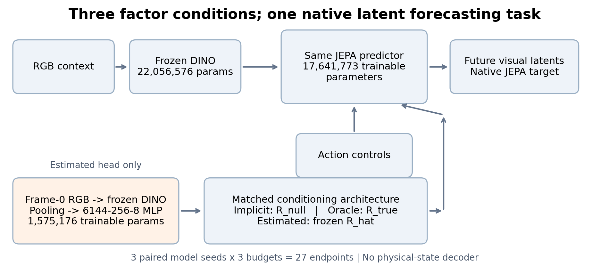
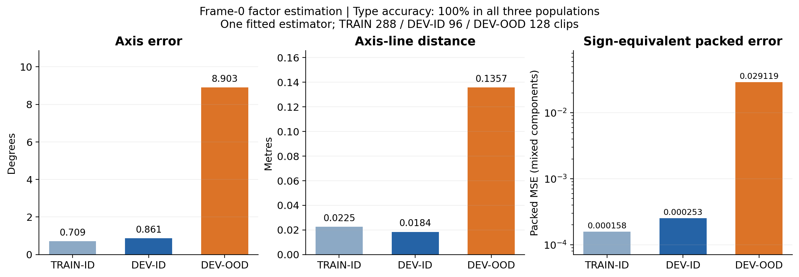
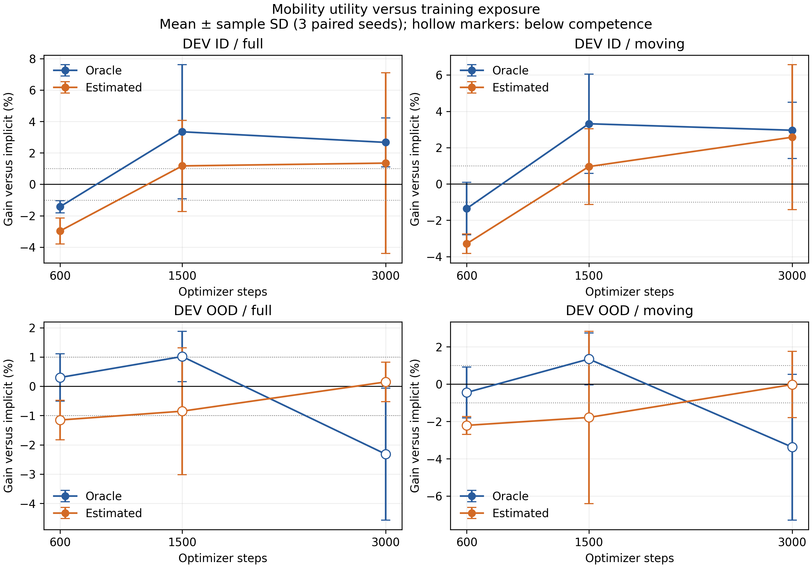
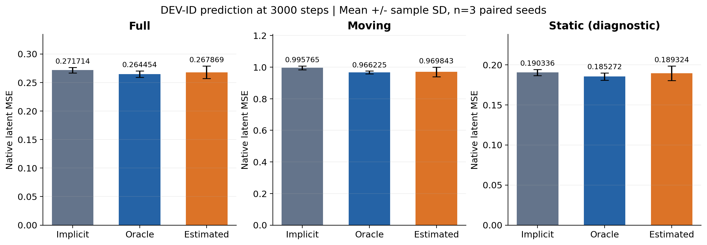
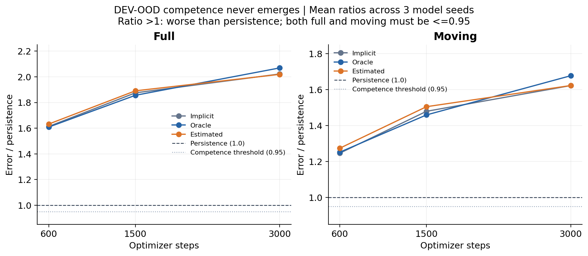
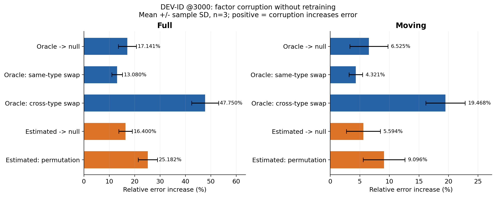
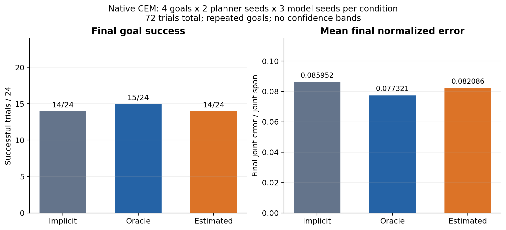

# JEPA-WMs × PHYWM：三条件正式实验进展与结果

**Implicit vs Oracle Mobility vs Estimated Mobility**

> **状态：三条件正式实验已完成。** 本页仅整理冻结结果，面向组内汇报；科学依据以[正式报告](../jepawms_three_condition_formal_v2.md)和冻结 receipts 为准。
>
> **核心发现：显式 mobility 的价值随 training exposure 改变。** 600 步时两个显式条件均有负效用；训练更久后 oracle 转为正效用，estimated 较晚转正且跨 seed 更不稳定。OOD 解释仍受 competence 限制。

## 1. 这条线在做什么

**科学问题：在一个成熟的外部 world-model backbone 中，显式提供 articulated-object mobility 信息，什么时候会比让模型隐式学习更有价值？**

JEPA-WMs 将 RGB observation 编码为 DINO latent representation，再用 action-conditioned predictor 预测未来 latent。这里的目标始终是 **JEPA-native future latent prediction**；没有加入 physical-state decoder，也没有改成物理状态回归任务。

| 条件 | dynamics 接收的 factor | 要回答的问题 |
|---|---|---|
| `implicit` | `R_null`，无显式物理标注的 null conditioning | 隐式学习能达到什么水平？ |
| `explicit_oracle` | `R_true`，来自模拟器的 mobility 标注 | 已知物理信息在当前编码下有多大价值？ |
| `explicit_estimated` | `R_hat`，仅由 frame-0 观测估计并冻结 | 可从观测获得的不完美物理信息有多大价值？ |

Source: [experiments/jepawms_three_condition_formal_v2/formal_matrix.json](../../experiments/jepawms_three_condition_formal_v2/formal_matrix.json)

## 2. 实验场景是什么

对象具有 **revolute joints** 或 **prismatic joints**：前者可以理解为门板绕轴旋转，后者可以理解为抽屉沿轴平移。

环境向 articulated objects 施加 wrench-like force/torque controls，模型预测这些控制导致的未来视觉 latent dynamics。**这不是机器人手臂抓取、开门任务，也不是完整 manipulation policy learning；当前研究的是 articulated-object dynamics forecasting。** RGB 来自合成物理场景，不能视为真实机器人视觉分布。

Source: [experiments/jepawms_stageA_v2/dataset_protocol.json](../../experiments/jepawms_stageA_v2/dataset_protocol.json)

## 3. 模型和参数规模

| 模块 | 参数数 | 更新方式 |
|---|---|---|
| JEPA dynamics | **17,641,773** | 三个条件均训练，架构一致 |
| Frozen visual representation | **22,056,576** | 三个条件均冻结 |
| Estimated-factor head | **1,575,176** | 单独监督训练，然后冻结 |

三个条件匹配的是 **JEPA dynamics** 的结构和训练预算。Estimated arm 额外使用 TRAIN mobility supervision 和 estimator compute，因此整个系统的参数、监督与计算成本并不相同；estimator compute 单独记录。

Source: [experiments/jepawms_three_condition_formal_v2/formal_matrix.json](../../experiments/jepawms_three_condition_formal_v2/formal_matrix.json)

## 4. 数据与 split

| Split | Clips | 身份关系 | 在本实验中的用途 |
|---|---|---|---|
| TRAIN-ID | **288** | 12 个训练 asset identities | dynamics 与 estimator 拟合 |
| DEV-ID | **96** | 与 TRAIN 相同身份，未见 trajectories | **主要且 competent 的评估区域** |
| DEV-OOD | **128** | 4 个 held-out asset identities | 新身份诊断；低于 persistence |

合计 **512 clips / 16 assets**，覆盖 8 个 revolute 与 8 个 prismatic assets。DEV-ID 的未见轨迹不等于未见对象；尤其对静态 frame-0 estimator，不能把 ID 准确度直接解释成新对象物理泛化能力。

Source: [experiments/jepawms_three_condition_formal_v2/inherited_id_ood_split.json](../../experiments/jepawms_three_condition_formal_v2/inherited_id_ood_split.json) · Source: [experiments/jepawms_stageA_v2/dataset_protocol.json](../../experiments/jepawms_stageA_v2/dataset_protocol.json)

## 5. 为什么先做 competence gate

如果基础 dynamics 还没有学到足以胜过简单基线的水平，explicit 与 implicit 的误差差异就难以支持物理信息价值的强解释。**先确认模型在该信息区域能预测，再解释 factor utility。**

Persistence baseline 直接保持当前 latent。冻结 competence gate 要求 pooled **full 与 moving error 均 ≤ 0.95 × persistence**。

| 信息区域 | 状态 | 可支持的解释 |
|---|---|---|
| ID | **competent** | 正式比较显式因素的边际 utility |
| OOD | **below persistence** | 展示原始误差与诊断，不给强 utility 结论 |

这两个状态应分别报告，不能把整个模型统称为“失败”。

Source: [experiments/jepawms_three_condition_formal_v2/ood_metrics.json](../../experiments/jepawms_three_condition_formal_v2/ood_metrics.json) · Source: [experiments/jepawms_formal_v1/competence_verdict.json](../../experiments/jepawms_formal_v1/competence_verdict.json)

## 6. 为什么 600 步不能算收敛

早期 fresh qualification 的 DEV-ID 曲线仍明显下降：

| Qualification steps | DEV-ID full MSE | DEV-ID moving MSE |
| --- | --- | --- |
| 100 | 0.4537 | 1.5048 |
| 300 | 0.3840 | 1.3604 |
| 600 | 0.3321 | 1.1876 |

六条正式 implicit/oracle 轨迹在 **300→600** 步之间，ID full error 还下降 **10.79–12.95%**，moving error 下降 **10.46–15.26%**。

**600 步足以验证 ID competence，但不足以证明收敛。** 因此 formal-v2 在新结果产生前冻结 **600 / 1500 / 3000**，测量 utility 如何随 exposure 变化；没有挑选最有利的 checkpoint。上述 qualification 数字属于较早的独立 qualification run，不是三 seed 正式均值。

Source: [experiments/jepawms_protocol_completion_audit_v1/current_budget_curve.json](../../experiments/jepawms_protocol_completion_audit_v1/current_budget_curve.json) · Source: [experiments/jepawms_protocol_completion_audit_v1/budget_assessment.json](../../experiments/jepawms_protocol_completion_audit_v1/budget_assessment.json)

## 7. 完整 B-stage 设计

**3 conditions × 3 paired seeds × 3 scientific budgets = 27 endpoints**，由 **9 training trajectories** 提供。

| 维度 | 冻结设置 |
|---|---|
| Conditions | `implicit` / `explicit_oracle` / `explicit_estimated` |
| Model seeds | **701 / 702 / 703** |
| Scientific budgets | **600 / 1500 / 3000 optimizer steps** |
| 新 dynamics updates | **23,400** |
| 复用 | 6 个已有 implicit/oracle @600 endpoints，继续训练到 3000 |
| Estimated | 3 条轨迹从 0 训练到 3000 |

匹配控制包括：**同架构、同 seed 内初始化、同 batch order、同 optimizer、同数据、同 native target、同预算**。Dynamics 中只有 factor 值不同。初始化与完整 3000-step batch-order equality 已核验；estimator 不与 dynamics 联合训练。

Source: [experiments/jepawms_three_condition_formal_v2/formal_matrix.json](../../experiments/jepawms_three_condition_formal_v2/formal_matrix.json) · Source: [experiments/jepawms_three_condition_formal_v2/batch_order_audit.json](../../experiments/jepawms_three_condition_formal_v2/batch_order_audit.json)

## 8. Estimated factor 是怎么来的

`frame-0 RGB → frozen DINO features → spatial pooling → 6144 → 256 → 8 MLP → structured R13`

8 个 head 输出为 type logits 2、axis 3、pivot 3，再按已有语义组装为 R13。R13 包括 axis、pivot、revolute-valid bit 和 linear/angular twist，保持已有 oracle 的物理语义。

只用 **288 TRAIN-ID clips，每 clip 一个 frame-0 观测**进行监督训练；使用固定最终 1500-step estimator checkpoint，而非按 DEV 或 downstream utility 选模型。通过验收后冻结权重和全部 512 行 `R_hat` cache，所有 dynamics seed 与预算共享该 cache。

**推理禁止输入：asset/joint ID、split identity、simulator state、actions、future frames、temporal history、oracle metadata。** 禁止信息审计通过。

Source: [experiments/jepawms_three_condition_formal_v2/estimator_protocol.json](../../experiments/jepawms_three_condition_formal_v2/estimator_protocol.json) · Source: [experiments/jepawms_three_condition_formal_v2/estimator_inference_firewall.json](../../experiments/jepawms_three_condition_formal_v2/estimator_inference_firewall.json)

## 9. Estimator 质量与 representation caveat

| Split | Type accuracy | Axis error | Axis-line distance | Raw packed MSE | Sign-equivalent MSE |
| --- | --- | --- | --- | --- | --- |
| TRAIN-ID | 100% | 0.709° | 0.0225 m | 0.146502 | 0.000158 |
| DEV-ID | 100% | 0.861° | 0.0184 m | 0.167948 | 0.000253 |
| DEV-OOD | 100% | 8.903° | 0.1357 m | 0.215917 | 0.029119 |

**DEV-ID 与 TRAIN 共享 asset identities；DEV-OOD 才是更强的新身份 estimator-generalization 诊断。** OOD 的轴线误差更大，即使 type accuracy 仍为 100%，也不能说整个 mobility 估计接近 oracle。

Revolute axis 存在 `a` 与 `−a` 的等价性，相关 twist 必须同步变号；pivot 沿 axis 移动也不改变轴线。实际存储的 signed-axis convention 还受微小模拟器残差影响。因此 raw packed MSE 混合了编码差异与物理误差，**需要同时报告 sign-equivalent MSE 与 axis/axis-line metrics**。Sign-equivalent MSE 是补充诊断，并未替换原始冻结验收指标。Axis-line 指标的分母是预测与 GT 均为 revolute 的样本。

Source: [experiments/jepawms_three_condition_formal_v2/estimator_metrics.json](../../experiments/jepawms_three_condition_formal_v2/estimator_metrics.json) · Source: [experiments/jepawms_three_condition_formal_v2/r_equivalence_audit.json](../../experiments/jepawms_three_condition_formal_v2/r_equivalence_audit.json)

## 10. 核心结果：training exposure 改变 explicit utility

定义 paired relative gain：

$$
\Delta(B)=\frac{E_{implicit}(B)-E_{explicit}(B)}{E_{implicit}(B)}\times100\%.
$$

先在每个 seed 内配对计算，再对三个 seed 求均值。**正值表示 explicit 优于 implicit；负值表示更差。** Full/moving 为主要区域，static 为诊断区域。

| Budget | Oracle full | Oracle moving | Estimated full | Estimated moving |
| --- | --- | --- | --- | --- |
| 600 | -1.425% | -1.353% | -2.969% | -3.292% |
| 1500 | +3.343% | +3.315% | +1.172% | +0.956% |
| 3000 | +2.668% | +2.957% | +1.349% | +2.576% |

图中的误差条是 **三个 paired model seeds 的 sample SD**，不是置信区间；下排 OOD 的空心点表示尚未通过 competence gate。表中的均值对应的 sample SD 如下：

| Budget | Oracle full / moving | Estimated full / moving |
| --- | --- | --- |
| 600 | 0.386% / 1.449% | 0.827% / 0.537% |
| 1500 | 4.273% / 2.729% | 2.900% / 2.081% |
| 3000 | 1.559% / 1.550% | 5.751% / 3.995% |

| Exposure | 科学解读 |
|---|---|
| **600** | oracle 与 estimated 均有负 ID utility |
| **1500** | oracle 转正；estimated 接近零/轻微正均值，冻结标签为 **null** |
| **3000** | oracle 持续正收益；estimated 平均也转正，但 seed variance 更大 |

标签按预先冻结的规则判断：均值超过 **±1%**，且至少 **2/3 seeds** 方向一致；否则 null。1500-step estimated full 虽有 +1.172% 均值，但只有一个 seed 为正，因此仍为 null。**这些标签不是统计显著性检验。**

Source: [experiments/jepawms_three_condition_formal_v2/budget_effects.json](../../experiments/jepawms_three_condition_formal_v2/budget_effects.json)

## 11. 3000 步最终预测性能

以下均为 DEV-ID，**mean ± sample SD，n=3 model seeds**：

| Condition | Full MSE | Moving MSE | Static MSE（诊断） |
| --- | --- | --- | --- |
| Implicit | 0.271714 ± 0.004880 | 0.995765 ± 0.011538 | 0.190336 ± 0.003698 |
| Oracle | 0.264454 ± 0.005661 | 0.966225 ± 0.009105 | 0.185272 ± 0.004531 |
| Estimated | 0.267869 ± 0.011023 | 0.969843 ± 0.030022 | 0.189324 ± 0.009142 |

**Oracle 在 3000 步改善全部三个 ID seeds 的 full 与 moving error。** Estimated 改善 seeds 701、703，但 seed 702 变差：full gain **−5.142%**、moving gain **−2.036%**。因此 estimated 的平均正效用更不稳定。

Source: [experiments/jepawms_three_condition_formal_v2/id_metrics.json](../../experiments/jepawms_three_condition_formal_v2/id_metrics.json) · Source: [experiments/jepawms_three_condition_formal_v2/budget_effects.json](../../experiments/jepawms_three_condition_formal_v2/budget_effects.json)

## 12. Oracle vs Estimated：信息质量的差距

Oracle 提供模拟器 GT physical information；estimated 提供 observation-derived imperfect physical information。Oracle 标注本身仍有上述编码等价性限制，不能当成唯一无歧义的向量。

下表定义 estimated disadvantage 为 `(E_estimated − E_oracle) / E_oracle`，正值表示 estimated 更差；均值与 sample SD 均在三个 paired seeds 上计算。

| Budget | Estimated full 劣势 | Estimated moving 劣势 |
| --- | --- | --- |
| 600 | +1.521% ± 0.448% | +1.925% ± 1.340% |
| 1500 | +2.299% ± 2.135% | +2.455% ± 0.920% |
| 3000 | +1.340% ± 5.235% | +0.389% ± 3.641% |

**最终 mean gap 变小，但 seed variance 仍大。** 当前 quality–utility 诊断不支持一个简单单调规律：`better estimator quality → larger downstream gain`。这一个 estimator 也不能把随机噪声、系统偏差和 signed representation 差异完全分离。

Source: [experiments/jepawms_three_condition_formal_v2/estimated_vs_oracle.json](../../experiments/jepawms_three_condition_formal_v2/estimated_vs_oracle.json) · Source: [experiments/jepawms_three_condition_formal_v2/estimator_quality_vs_utility.json](../../experiments/jepawms_three_condition_formal_v2/estimator_quality_vs_utility.json)

## 13. OOD：为什么现在不能强解释

以下为三个 model seeds 的 mean **full / moving error-to-persistence ratio**：

| Budget | Implicit full / moving | Oracle full / moving | Estimated full / moving |
| --- | --- | --- | --- |
| 600 | 1.614 / 1.247 | 1.609 / 1.253 | 1.632 / 1.275 |
| 1500 | 1.875 / 1.480 | 1.856 / 1.460 | 1.891 / 1.505 |
| 3000 | 2.022 / 1.623 | 2.069 / 1.678 | 2.019 / 1.623 |

**Ratio > 1 表示比 persistence 更差。** 所有条件在所有预算均未通过冻结 competence gate，并且 OOD dynamics 随更多 exposure 变差。

因此 oracle 与 estimated 的 OOD utility 均标记为 **`uninterpretable-below-competence`**。原始条件差异仍保留，但不能由此强断言“显式 factors 导致 OOD 泛化损害”。ID 与 OOD 必须分开解释。

Source: [experiments/jepawms_three_condition_formal_v2/ood_metrics.json](../../experiments/jepawms_three_condition_formal_v2/ood_metrics.json) · Source: [experiments/jepawms_three_condition_formal_v2/final_verdict.json](../../experiments/jepawms_three_condition_formal_v2/final_verdict.json)

## 14. Action sensitivity：有没有忽略控制？

在 **3000-step DEV-ID moving region**，不重训、仅破坏 action，平均相对误差增幅为：

| Condition | Shuffled action | Zero action |
| --- | --- | --- |
| Implicit | +71.668% | +62.879% |
| Oracle | +74.503% | +66.805% |
| Estimated | +75.053% | +70.137% |

**三个模型都强烈依赖 action。显式 R 条件下，action 仍然是重要输入。** 这些干预支持 action 的功能性使用，而不是证明每个控制机制都被正确识别。

Source: [experiments/jepawms_three_condition_formal_v2/action_sensitivity.json](../../experiments/jepawms_three_condition_formal_v2/action_sensitivity.json)

## 15. Factor corruption：模型到底有没有使用 R？

在 **3000-step DEV-ID**，保留已训练模型与 targets，不重训，只将本模型 factor 改为 null 或交换/permutation：

| ID @3000 intervention | Full MSE 增幅 | Moving MSE 增幅 |
| --- | --- | --- |
| Oracle -> null | +17.141% | +6.525% |
| Oracle: same-type swap | +13.080% | +4.321% |
| Oracle: cross-type swap | +47.750% | +19.468% |
| Estimated -> null | +16.400% | +5.594% |
| Estimated: permutation | +25.182% | +9.096% |

> 数值核对：任务文本中的 oracle cross-type full 为 +41.927%；冻结正式报告与 `final_verdict.json` 一致记录为 **+47.750%**，本页按权威冻结来源呈现。

**正值表示破坏 factor 后预测更差。** 图中误差条为三个 model seeds 的 sample SD。完整 receipts 保留实际换入向量的距离与 hash；raw R13 L2 混合物理单位与 sign 等价性，不能只根据“换了对象”就假设干预足够强。

Source: [experiments/jepawms_three_condition_formal_v2/factor_corruption_oracle.json](../../experiments/jepawms_three_condition_formal_v2/factor_corruption_oracle.json) · Source: [experiments/jepawms_three_condition_formal_v2/factor_corruption_estimated.json](../../experiments/jepawms_three_condition_formal_v2/factor_corruption_estimated.json) · Source: [experiments/jepawms_three_condition_formal_v2/final_verdict.json](../../experiments/jepawms_three_condition_formal_v2/final_verdict.json)

## 16. Usage 与 utility 必须分开测量

| 概念 | 问题 | 对应证据 |
|---|---|---|
| **Usage** | 模型是否功能性地依赖 R？ | 固定模型的 factor corruption |
| **Utility** | 正常给 R 是否比匹配 implicit 更好？ | 跨条件 paired prediction comparison |

**“破坏 R 会变差”不自动意味着“给 R 优于 implicit”。**

| 阶段 | 已支持的结论 |
|---|---|
| 600 | 早期 oracle corruption 已支持 **used but harmful**；estimated 的 ID utility 为负，但没有对应的 600-step estimated corruption，不能同步断言其 usage |
| 3000 | oracle 与 estimated 在 ID full/moving 均为 **used and useful** |
| OOD | factor sensitivity 可测，但 utility 仍受 competence 限制 |

Source: [早期正式报告 H 节](../jepawms_formal_v1.md)（oracle @600） · Source: [experiments/jepawms_three_condition_formal_v2/final_verdict.json](../../experiments/jepawms_three_condition_formal_v2/final_verdict.json)

## 17. Planning：小规模 native CEM 检查

沿用 native CEM，以 latent goal distance 为目标，比较相同 frozen goal panel 的三个条件：

**4 goals × 2 planner seeds × 3 model seeds × 3 conditions = 72 trials**。

| Condition | 成功数 | Mean final error / joint span | 描述性判定 |
| --- | --- | --- | --- |
| Implicit | 14/24 | 0.085952 | 参照 |
| Oracle | 15/24 | 0.077321 | descriptively positive |
| Estimated | 14/24 | 0.082086 | planning null |

Oracle 多成功 **1/24 trial**，pooled error 更低，按冻结描述性规则判为 positive；seed 701 的 oracle error 却更高。Estimated 成功数与 implicit 相同，因此 planning null。全部 72 次 prefix-state replay parity error 为零。

**这只是四个重复 goals 上的 secondary、open-loop planning diagnostic；不是大规模 closed-loop manipulation benchmark，也不构成一般 MPC 改进证据。** 72 trials 不等于 72 个独立任务。

Source: [experiments/jepawms_three_condition_formal_v2/planning_metrics.json](../../experiments/jepawms_three_condition_formal_v2/planning_metrics.json)

## 18. 当前最重要的科学结论

> **1. Explicit mobility 并非始终有益。**
>
> **2. 600-step early exposure 下，oracle 与 estimated 均降低 ID prediction performance。**
>
> **3. 更长训练后，oracle 在 1500/3000 转为正 utility；3000 时三个 seeds 的方向一致。**
>
> **4. Estimated 在 3000 平均转正，但更晚、跨 seed 变异更大。**
>
> **5. 本次结果表明 utility 与 training exposure、factor 信息质量条件有关；尚未建立普遍或单调因果规律。**
>
> **6. Functional usage 与 marginal utility 是两个独立问题，必须分别测量。**
>
> **7. OOD learner 从未胜过 persistence，新身份 utility 仍未解决。**

| 冻结 verdict | ID full / moving 或对应范围 |
|---|---|
| `ORACLE_UTILITY_ID` | **budget-dependent** |
| `ESTIMATED_UTILITY_ID` | **budget-dependent** |
| `ORACLE_UTILITY_OOD` | **uninterpretable-below-competence** |
| `ESTIMATED_UTILITY_OOD` | **uninterpretable-below-competence** |
| Final ID factor usage | **oracle、estimated 均 used and useful** |
| Planning | **oracle descriptively positive / estimated null** |

Source: [experiments/jepawms_three_condition_formal_v2/final_verdict.json](../../experiments/jepawms_three_condition_formal_v2/final_verdict.json)

## 19. 和论文主问题的关系

**When Is a Physical Factor Worth Making Explicit?**

本次 JEPA 外部 backbone replication 提供一个具体边界维度 **training exposure**，并同时比较 **factor quality：oracle vs estimated**。

`Utility = f(training exposure, factor quality, information regime, …)`

这是组织后续研究的概念表达，不是本次拟合的函数。**JEPA 单条实验不能建立完整 representation boundary，也不能推广成物理先验普遍有益的结论。** 结果针对当前 13D 编码与数据/预测协议；mobility 与 asset identity 的作用尚未被完全分离。

Source: [experiments/jepawms_three_condition_formal_v2/final_verdict.json](../../experiments/jepawms_three_condition_formal_v2/final_verdict.json) · Source: [正式报告 K 节](../jepawms_three_condition_formal_v2.md)；[早期正式报告的 identity caveat](../jepawms_formal_v1.md)

## 20. 与之前 600-step 结论的关系

早期总体报告为 **`JEPA_FORMAL_NULL`**，同时保留了小幅负 ID effect。该标签并不表示各个区域的效应都恰为零。

**旧的 600-step negative/null 是真实的局部预算结果。** 新实验复用了这些有效 endpoints；更长训练表明该结论随 exposure 改变，并不说明旧结果“错了”。报告应该同时呈现早期负结果与后期正结果。

Source: [早期正式报告](../jepawms_formal_v1.md) · Source: [experiments/jepawms_three_condition_formal_v2/budget_effects.json](../../experiments/jepawms_three_condition_formal_v2/budget_effects.json)

## 21. 局限与证据级别

| 限制 | 解读边界 |
|---|---|
| 16 assets，总计仅 4 OOD identities | 不足以建立广泛新对象规律 |
| Synthetic RGB | 与真实机器人视觉仍有分布差异 |
| DEV-ID estimator 共享训练对象身份 | 不能证明新对象物理 identifiability |
| Signed-axis / pivot 等价性 | packed error 与物理误差不可混为一谈 |
| 一次 estimator 训练、三个 dynamics seeds | estimated variance 与 noise 机制仍未完全分解；不宣称统计显著性 |
| 四个 frozen planning goals | 仅 secondary diagnostic，不能推广为通用规划性能 |
| OOD dynamics 始终 below persistence | 不给强 OOD factor-utility 判定 |

冻结 **600/1500/3000 prediction comparisons 是该协议内的正式结果**。Estimator quality、质量–utility correlations、action/factor interventions 和 planning 为诊断证据。完整 per-seed、per-horizon、paired differences 与 sample SD 保存在正式层，本页只压缩呈现，不改变其定义。

Source: [experiments/jepawms_three_condition_formal_v2/final_verdict.json](../../experiments/jepawms_three_condition_formal_v2/final_verdict.json) · Source: [正式报告 K 节](../jepawms_three_condition_formal_v2.md)

## 22. 下一步：区分局部 follow-up 与项目优先级

| 范围 | 下一步 |
|---|---|
| **JEPA-local possible follow-up** | 在新冻结矩阵中比较 numerically stable sign convention，做 representation audit；不回改当前数据与结果 |
| **Project priority** | 按项目安排推进 PointWorld competence/B-stage 与主线 controlled PHYWM boundary experiment |

**JEPA 已足够完整，可作为一个 external replication。** 上述项目优先级是后续工作安排，不是本次 JEPA 结果推导出的 PointWorld 状态，也不意味着自动继续扩大 JEPA 计算预算。本展示任务没有启动这些实验。

Source: [正式报告 K 节](../jepawms_three_condition_formal_v2.md)（JEPA-local proposal）；项目优先级按本次展示任务要求陈述。

## 23. 科学追溯与归档

- **权威结果：** [正式 scientific report](../jepawms_three_condition_formal_v2.md)。
- **冻结结果与完整数据表：** [experiment artifacts](../../experiments/jepawms_three_condition_formal_v2/)。
- **完整 endpoint per-clip errors：** [NPZ archive](../../experiments/jepawms_three_condition_formal_v2/per_clip_endpoint_errors.npz)，[schema](../../experiments/jepawms_three_condition_formal_v2/per_clip_archive_schema.json)。
- **展示图片来源/hash：** [assets_manifest.json](assets_manifest.json)。
- **GitHub 相对图片路径检查：** [github_render_audit.json](github_render_audit.json)。
- **正式层未修改检查：** [source_preservation_audit.json](source_preservation_audit.json)。

本页只读取已冻结 receipts。训练、Slurm、模型推理、数据生成与 scientific endpoint regeneration 均未执行；权威正式报告与 scientific artifacts 保持原样。

## 24. GitHub / Notion 使用

README 中所有图片都位于同目录下的 `assets/`，采用相对路径，GitHub 可直接渲染。

如果需要导入 Notion，可将 `README.md` 与 `assets/` 一并下载，或将 assets 中的图片重新上传至 Notion。
